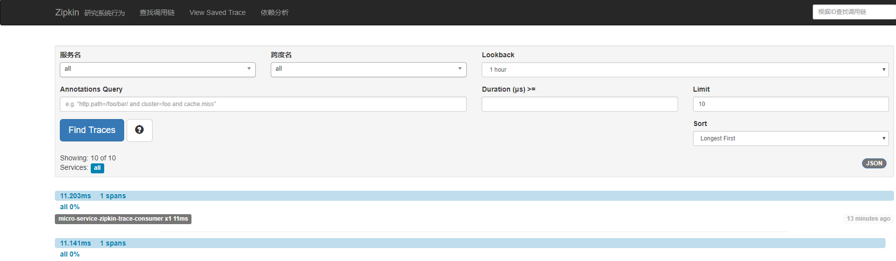
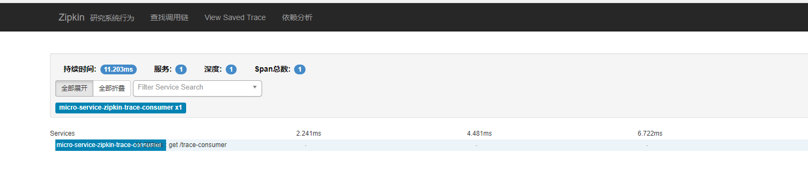

# spring-cloud-sleuth+zipkin追踪服务实现
> Spring Cloud 是基于 Java 的分布式服务平台，提供一系列的分布式服务所需的中间件。其中，用于分布式服务跟踪的模块是 Spring Cloud Sleuth。

> Spring Cloud Sleuth 主要用于收集 Spring Boot 程序中的数据，即上文所说的数据收集。其包含的 spring-cloud-sleuth-zipkin 模块可以把收集到的数据发送到 zipkin 服务器。Zipkin 本身具有数据存储和展示的功能，这样，我们就可以在 Spring Boot 系统中埋入 Spring Cloud Sleuth 收集数据，在后台使用 Zipkin 服务作为数据存储和展示的服务。

> 使用 Zipkin 作为后台的另一个好处是，Zipkin 除了支持 Spring Cloud Sleuth 以外，还支持其他开发语言和平台的数据收集器。这使得在系统中让不同种种语言开发的服务可以共存。
  
> 首先，我们要搭建一个 Zipkin 的后台服务，然后把我们已有的 Spring Boot 服务中埋入 Spring Cloud Sleuth，最后，将 Spring Cloud Sleuth 接入 Zipkin 服务，一个非常简单的分布式服务跟踪服务就搭建起来了。

## Zipkin 服务端
关于 Zipkin 的服务端，在使用 Spring Boot 2.x 版本后，官方就不推荐自行定制编译了，反而是直接提供了编译好的 jar 包来给我们使用，
详情请看 [pgrade to Spring Boot 2.0 NoClassDefFoundError UndertowEmbeddedServletContainerFactory · Issue #1962 · openzipkin/zipkin · GitHub](https://github.com/openzipkin/zipkin/issues/1962)
并且以前的`@EnableZipkinServer`也已经被打上了`@Deprecated`
>If you decide to make a custom server, you accept responsibility for troubleshooting your build or configuration problems, even if such problems are a reaction to a change made by the OpenZipkin maintainers. In other words, custom servers are possible, but not supported.

EnableZipkinServer.java
[github.com/openzipkin/zipkin/blob/master/zipkin-server/src/main/java/zipkin/server/EnableZipkinServer.java](https://github.com/openzipkin/zipkin/blob/master/zipkin-server/src/main/java/zipkin/server/EnableZipkinServer.java)

**简而言之就是：私自改包，后果自负。**

所以官方提供了一键脚本
```bash
curl -sSL https://zipkin.io/quickstart.sh | bash -s
java -jar zipkin.jar
```

如果用 Docker 的话，直接
```bash

docker run -d -p 9411:9411 openzipkin/zipkin
```

 Zipkin Server在启动时指定使用elasticsearch作为追踪日志存储方式：
```bash
    java -jar zipkin.jar --STORAGE_TYPE=elasticsearch --DES_HOSTS=http://localhost:9200 > 1.log
```

任一方式启动后，访问` http://localhost:9411/zipkin/` 就能看到如下界面，嗯还有汉化看起来不错

## 整合springboot sleuth 和zipkin
Spring 应用在监测到 classpath 中有 Sleuth 和 Zipkin 后，会自动在 WebClient（或 RestTemplate）的调用过程中向 HTTP 请求注入追踪信息，并向 Zipkin Server 发送这些信息。

### 进行验证
我们分别启动 注册中心`registry-center-cluster`、`zipkin`、服务提供方`micro-service-zipkin-trace-provider`、服务消费方`micro-service-zipkin-trace-consumer`，然后
访问 `http://localhost:8551/trace-consumer` 可以得到返回值【trace-service-provider】，同时还能在它们的控制台中分别获得下面的输出：

## zipkin跟踪信息查看
> 访问 `http://localhost:9411/zipkin/`  点击 Find Traces 会看到有一条记录

选择一条 ，查看详细内容


## 遗留问题
* 在 in-memory模式中，依赖分析不能用。查看了官方文档发现没有明确说明。而是说另外两种方式（Cassandra、Elasticsearch）的话，需要单独启动一个`spark job`才可以。
* https://github.com/openzipkin/zipkin/

##  参考
* https://blog.csdn.net/forezp/article/details/70162074
* https://www.cnblogs.com/softidea/p/6854989.html
* http://www.cnblogs.com/shunyang/p/7011283.html