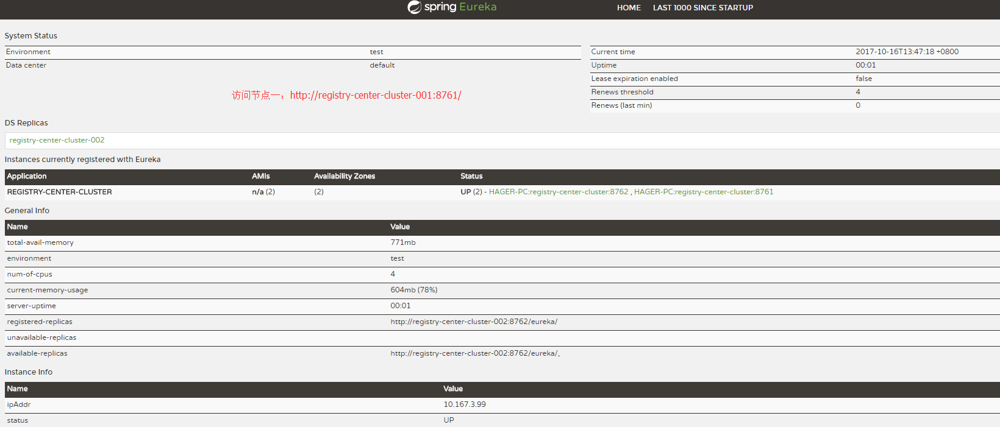
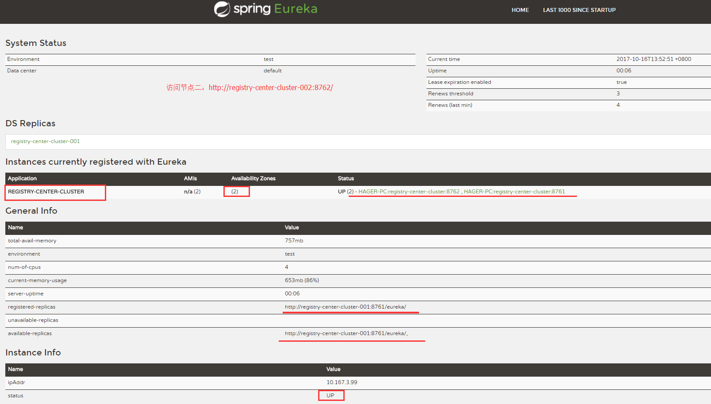

# registry center (Service Discovery: Eureka Server)

* 注册中心，管理服务的注册和发现；
* 如果保证高可用，可以搞成集群形式；

## 参考资料

* http://cloud.spring.io/spring-cloud-static/Dalston.SR4/multi/multi_spring-cloud-eureka-server.html
* http://www.bijishequ.com/detail/368386

## 依赖包

```XML
<dependency>
    <groupId>org.springframework.cloud</groupId>
	<artifactId>spring-cloud-starter-eureka-server</artifactId>
</dependency>
```

## 注解标识为注册中心服务端

```java
@EnableEurekaServer // 注解为注册中心
@SpringBootApplication
public class MicroServiceRegistryApplication {

    public static void main(String[] args) {
        SpringApplication.run(MicroServiceRegistryApplication.class, args);
    }
}

```


## application.properties 配置

> 配置为Standalone模式；集群模式看`registry cluster`小节；

* 配置文件，可以是properties、yml格式；可以根据不同环境配置不同的配置文件，这样就可以启用一些跟环境相关的配置了，遵循格式为`application-{env}.properties`或 `application-{env}.yml`
* 在`application.properties`主配置文件中，指定`spring.profiles.active={env}`即可；

```bash
# 站点端口设置，不配置，Eureka默认也是8761
server.port=8761
eureka.instance.hostname=localhost
#通过eureka.client.registerWithEureka：false和fetchRegistry：false来表明自己是一个eureka server.
# 不注册client端，只注册服务端
eureka.client.register-with-eureka=false
eureka.client.fetch-registry=false
# 虽然提示不全，但是还是要配置的
eureka.client.service-url.defaultZone=http://${eureka.instance.hostname}:${server.port}/eureka/
# 配置启用哪个环境配置文件
spring.profiles.active=dev
# 关闭对应log
logging.level.com.netflix.eureka=off
logging.level.com.netflix.discovery=off
```

## registry cluster

> 配置集群注册中心，通过配置多个defaultZone的值，实现集群；
* 其中 `eureka.instance.hostname` 需要在host文件中配置对应IP映射；比如配置两个server；
  * windows下，在/etc/hosts中，增加；
  * linux下，在/etc/hosts中，增加；`vim /etc/hosts`

```bash
127.0.0.1 registry-center-cluster-001
127.0.0.1 registry-center-cluster-002
...
```

```bash
eureka.client.service-url.defaultZone=http://registry-center-cluster-002:8762/eureka/,http://registry-center-cluster-001:8761/eureka/
```

## 完整的集群配置文件（此处只模拟两台集群）

* 第一台 `registry server`（registry-center-cluster-001:8761）

```bash
# 站点端口设置，不配置，Eureka默认也是8761
server.port=8761

# 示例集群配置,需要把registry-center-cluster-001 配置到host文件中
# 比如 
# 127.0.0.1 registry-center-cluster-001
# 127.0.0.1 registry-center-cluster-002
#
#
eureka.instance.hostname=registry-center-cluster-001
# 项目名称
spring.application.name=register-master
#
# 利用IP地址，而非hostname
#eureka.instance.prefer-ip-address=true

#通过eureka.client.registerWithEureka：false和fetchRegistry：false来表明自己是一个eureka server.
# 不注册client端，只注册服务端,如果是集群方式，默认(默认为true)即可
# eureka.client.register-with-eureka=false
# eureka.client.fetch-registry=false
# 单机配置，配置为自己即可
#eureka.client.service-url.defaultZone=http://${eureka.instance.hostname}:${server.port}/eureka/
# 集群配置，配置
eureka.client.service-url.defaultZone=http://registry-center-cluster-002:8762/eureka/
# 配置启用哪个环境配置文件
spring.profiles.active=dev

```

* 第二台 `registry server`（registry-center-cluster-002:8762）

```bash
# 站点端口设置，不配置，Eureka默认也是8762
server.port=8762
# 示例集群配置,需要把registry-center-cluster-001 配置到host文件中
# 比如 127.0.0.1 registry-center-cluster-001
# 127.0.0.1 registry-center-cluster-002
eureka.instance.hostname=registry-center-cluster-002
# 项目名称
spring.application.name=register-master
# 利用IP地址，而非hostname
#eureka.instance.prefer-ip-address=true
#通过eureka.client.registerWithEureka：false和fetchRegistry：false来表明自己是一个eureka server.
# 不注册client端，只注册服务端,如果是集群方式，默认(默认为true)即可
# eureka.client.register-with-eureka=false
# eureka.client.fetch-registry=false
# 集群配置，配置
eureka.client.service-url.defaultZone=http://registry-center-cluster-001:8761/eureka/
# 配置启用哪个环境配置文件
spring.profiles.active=dev

```

## 2017年10月15日

## 如果利用yaml配置文件的话，可以这么配置（也建议用yaml文件配置，简单些吧）

```bash
# 公共配置
spring:
  application:
    name: registry-center-cluster
#    同一个项目，application.name一致；

---
# 第一个节点配置
#      通过指定 spring.profiles.active=registry-center-cluster-001 来启动第一个节点
# 比如 java jar micro-service-registry-0.0.1-SNAPSHOT.jar --spring.profiles.active=registry-center-cluster-001

server:
  port: 8761

eureka:
  instance:
    hostname: registry-center-cluster-001
  client:
#  设置为另外一个注册中心节点，这样达到双双彼此互联
    service-url:
      defaultZone: http://registry-center-cluster-002:8762/eureka/
#    默认为true
    fetch-registry: true
    register-with-eureka: true
#    是否启动自我保护模式，如果启用；当该节点有问题时，
# 如果设置为false，所谓自我保护模式是指，出现网络分区、eureka在短时间内丢失过
# 多客户端时，会进入自我保护模式，即一个服务长时间没有发送心跳，eureka也不会将其删除。默认为true
  server:
    enable-self-preservation: false

spring:
  profiles: registry-center-cluster-001

---


# 第二个节点配置
#      通过指定 spring.profiles.active=registry-center-cluster-002 来启动第二个节点


server:
  port: 8762


eureka:
  instance:
    hostname: registry-center-cluster-002
  client:
#  设置为另外一个注册中心节点，这样达到双双彼此互联
    service-url:
      defaultZone: http://registry-center-cluster-001:8761/eureka/
spring:
  profiles: registry-center-cluster-002
```

## 启动效果

* 节点一



* 节点二



## 知识点

The Eureka server does not have a backend store, but the service instances in the registry all have to send heartbeats to keep their registrations up to date (so this can be done in memory). Clients also have an in-memory cache of eureka registrations (so they don’t have to go to the registry for every single request to a service).

Eureka服务器没有后端存储，但注册表中的服务实例都必须发送心跳以保持其注册更新（所以这可以在内存中完成）。 

客户端还具有eureka注册的内存缓存（因此，他们不必一次到服务器的每个请求注册表）。

By default every Eureka server is also a Eureka client and requires (at least one) service URL to locate a peer. If you don’t provide it the service will run and work, but it will shower your logs with a lot of noise about not being able to register with the peer.
默认情况下，每个Eureka服务器也是Eureka客户端，并且需要（至少一个）服务URL来定位对等体。 如果您不提供该服务将运行和工作，但它将淋浴您的日志与大量的噪音无法注册对等体。
-- 这个网上翻译有点别扭，大概意思是，单节点也可以运行，只不过其他的节点无法检测并使用它。